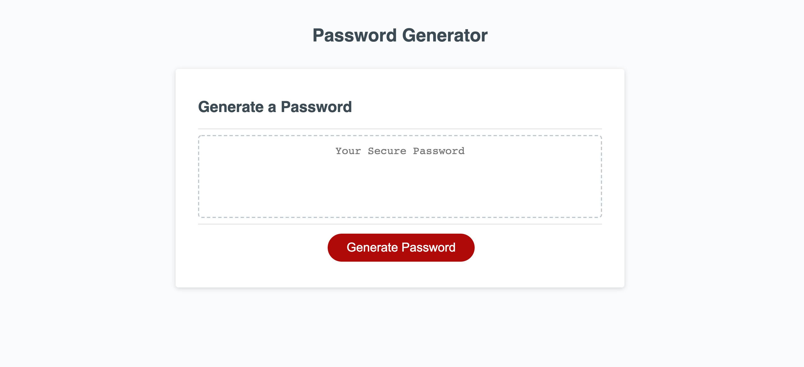

# password-generator
A secure password generating javascript webpage 

# Motivation for this project

To learn how to update javascript code to create a starter generate passwordd, while also learning how to group things together and create a collection by using arrays. 

# Reason for this project 

Create an application that enables employees to generate random passwords based on the criteria they’ve selected

# What I learned from this project 

In this activity I learnt:

* The importance of stackoverflow when in a bind 

* How to start HW assignemnets; step by step breaking down of the acceptance criteria 

* How to get a random item from an array 

* How to use variables and functions 

* How to group things together and create a collection 

https://conso97.github.io/password-generator/

